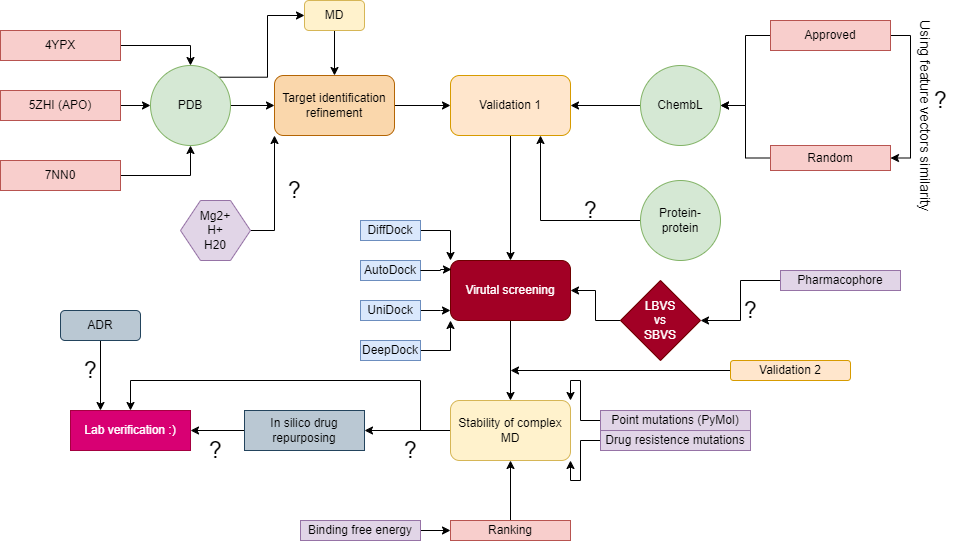

## Rough workflow diagram

## TODO List

### Development
- [x] **Handle unresolved small molecules (ligands)**  
  _Ensure all small molecules are properly resolved for the workflow._
- [x] **Add a script for pre-processing:**  
  - Remove waters.  
  - Add hydrogens with different protonation states.  
- [x] **Dockerize the entire workflow**  
  _Make the workflow reproducible and functional across environments._

### Execution & Deadlines
- [x] **Run the workflow**  
  _ Deadline: **31.12.**_

### Validation & Results
- [x] **Validate the workflow**  
  _Start right after New Year's Eve:_
  - **Trm5 docking** with the top structure.
  - **Lepšík's SQM2.20** validation using top structures.

### Presentation
- [x] **Create a poster**  
  _Prepare a poster right after New Year's Eve._

