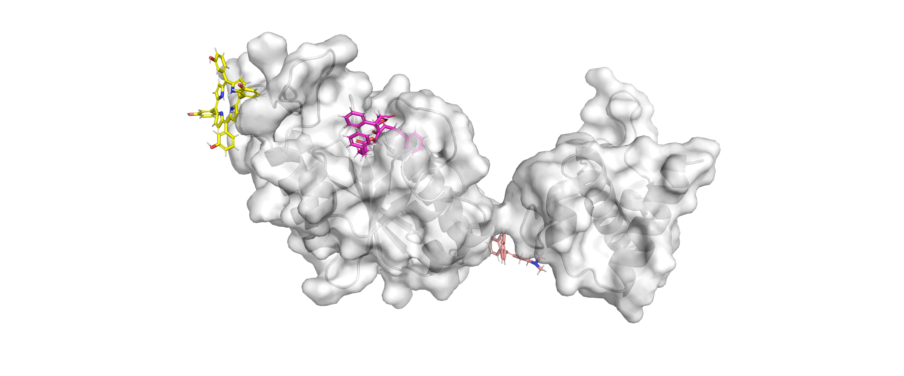

# TrmD Inhibitor Discovery Project

## Team
- [Anna Gregušová](https://github.com/AnnaGregusova)
- [Aneta Tranová](https://github.com/anetatranova)
- [Marek Tobiáš](https://github.com/tobiasmarek)
- [Tomáš Preisler](https://github.com/preislet)
- [Tomáš Jelínek](https://github.com/Desperadus)

Competition organized by 4EU+ [Meet-EU 2024 official website](https://exsto1.github.io/meet-eu-2024/)

## Introduction

This repository contains the code and data for the project "Solving TrmD Binding Problem Using Evolution Inspired Algorithm," which focuses on the discovery of novel inhibitors for the bacterial enzyme TrmD, a promising target for antibiotic development. We employ a two-pronged computational approach:

1. **Virtual Screening of FDA-Approved Molecules:** We first established a baseline by screening a library of FDA-approved molecules against TrmD using molecular docking.
2. **EvoFLOPA Evolutionary Algorithm:** We then developed a novel evolutionary algorithm, EvoFLOPA, to optimize lead molecules for improved binding affinity, synthetic accessibility, and drug-likeness.

## Methods

### 1. Virtual Screening of FDA-Approved Molecules

This method aimed to establish a benchmark for TrmD inhibitor discovery using known, safe-for-human molecules.

#### Workflow:

1. **Data Preparation:**
    *   **FDA-Approved Molecules:** A library of FDA-approved molecules was obtained and prepared using [RDKit](https://www.rdkit.org/). The preparation involved sanitization, protonation, charge assignment (using Gasteiger charges), and selecting the largest molecular component to overcome issues with multi-component structures.
    *   **TrmD Protein:** The crystal structure of TrmD from *Haemophilus influenzae* (PDB ID: 4YVG) was used as the receptor. The protein was prepared by removing water molecules and adding hydrogen atoms.

2. **Identification of Docking Targets:**
    *   Three potential binding sites on TrmD were identified using [P2Rank](https://prankweb.cz/):
        *   **AdoMet Pocket:** The binding site for the cofactor S-adenosylmethionine (SAM).
        *   **tRNA Binding Site:** The region where TrmD interacts with its tRNA substrate.
        *   **Dimerization Site:** The interface between the two TrmD monomers, potentially offering allosteric inhibition opportunities.

3. **Molecular Docking:**
    *   Docking simulations were performed using [UniDock](https://github.com/dptech-corp/Uni-Dock), a GPU-accelerated docking program.
    *   The Vinardo scoring function was used to estimate binding affinity.

4. **Benchmarking:**
    *   Docking scores were analyzed to establish a baseline for binding affinity and to assess the performance of our docking protocol.

### 2. EvoFLOPA: Evolutionary Fast Lead Optimization Algorithm

EvoFLOPA is a novel evolutionary algorithm designed to optimize lead molecules for improved TrmD inhibition.

#### Key Features:

*   **Molecular Representation:** Uses SELFIES (Simplified Molecular-Input Line-Entry System) strings to represent molecules, ensuring the generation of chemically valid structures.
*   **Mutation:** Implements a modified STONED algorithm for introducing mutations into SELFIES strings, including atom addition, deletion, and replacement.
*   **Breeding:** Incorporates a breeding step that combines genetic material from two parent molecules based on Levenshtein distance and edit path generation.
*   **Docking and Scoring:**
    *   Uses UniDock for molecular docking into the AdoMet binding site of TrmD.
    *   Employs a multi-objective loss function that considers:
        *   **Binding Affinity:** Estimated using the Vinardo scoring function.
        *   **Synthetic Accessibility (SA):** Calculated using RDKit.
        *   **Drug-Likeness (QED):** Calculated using RDKit.
*   **Iterative Optimization:** Employs a k-beam simulated annealing approach to iteratively improve a population of molecules through generations, using a combination of mutation, breeding, docking, and scoring.
*   **Validation:** Top-ranked molecules are rescored using RTMScore, a deep learning-based scoring function, for improved accuracy and generalization.
*   **ADMET Prediction:** Includes ADMET (Absorption, Distribution, Metabolism, Excretion, and Toxicity) predictions, specifically DILI (Drug-Induced Liver Injury), to assess potential drug-like properties and toxicities.

#### Workflow:

1. **Initialization:** Starts with a set of known TrmD inhibitors as initial "LEAD" molecules.
2. **Mutation:** Introduces mutations into the SELFIES strings of parent molecules.
3. **Breeding:** Combines genetic material from parent molecules to create offspring.
4. **Docking:** Docks generated molecules into the AdoMet binding site using UniDock.
5. **Scoring:** Evaluates molecules based on the multi-objective loss function.
6. **Selection:** Selects the top-ranking molecules and probabilistically selects molecules for the next generation based on their loss scores.
7. **Iteration:** Repeats steps 2-6 for a defined number of iterations.
8. **Validation and ADMET Prediction:** Rescores top molecules with RTMScore and performs ADMET predictions.

### Documentation 
Full documentation can be found in the `Info` folder.
